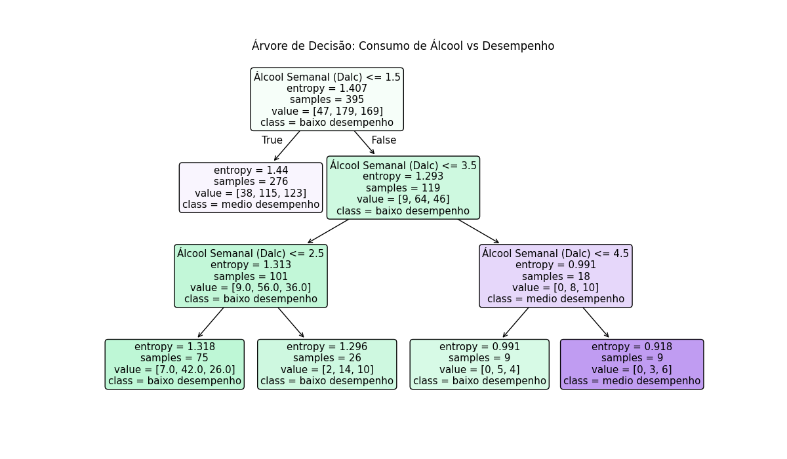
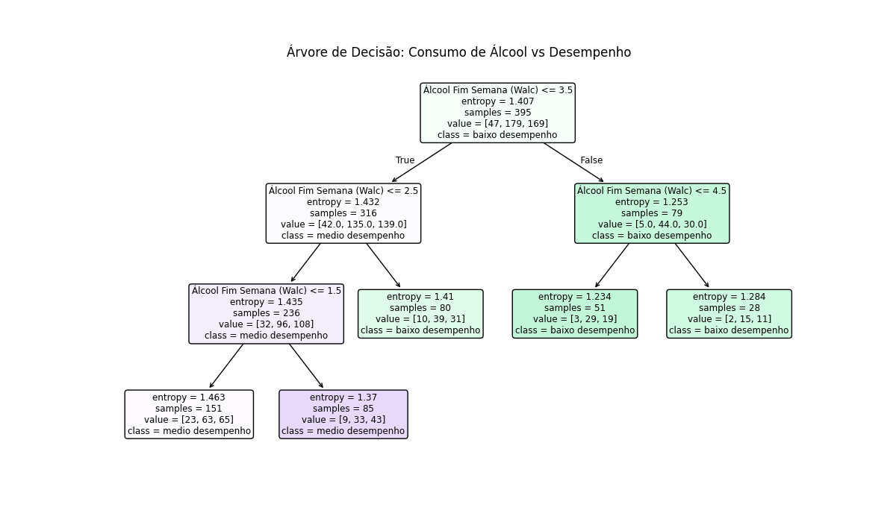

# Análise do Consumo de Álcool Por Média dos Alunos em Matemática

## Sobre o projeto

Este projeto apresenta uma análise de dados com base no conjunto **Student Performance**, disponibilizado pela UCI Machine Learning Repository. O objetivo é investigar a relação entre o **consumo de álcool no fim de semana** (`Walc`) e o **desempenho final dos alunos na disciplina de matemática**, medido pela nota final (`G3`).

A análise utiliza uma **árvore de decisão** para identificar padrões entre o consumo de álcool na semana e finais de semana, pelo desempenho das notas dos estudantes, além de um **fluxograma** que facilita a visualização das regras de decisão geradas pelo modelo.

---

### Variáveis principais analisadas

- **Walc**: consumo de álcool no fim de semana  
  - Escala numérica de **1 a 5**
  - `1` = muito baixo
  - `5` = muito alto

- Notas de matemática com escala numérica de **0 a 20**
    - **G1**: primeiro semestre  
    - **G2**: segundo semestre  
    - **G3**: nota final 

---

## Fonte dos dados

Os dados utilizados neste projeto foram obtidos no repositório oficial da UCI:

- [Student Performance - UCI Machine Learning Repository](https://archive.ics.uci.edu/dataset/320/student+performance)

### Observação importante sobre o dataset

Segundo a documentação do conjunto de dados, existem **382 estudantes que aparecem em ambos os datasets** disponibilizados pela base. 

---

## Estrutura do projeto

```text
├── assets/
│   ├── arvore_decisao.png
│   └── fluxograma.png
├── student/
│  =├── student-mat.csv
│   └── student.txt
├── arvore_decisao_dalc.py
├── arvore_decisao_walc.py
└── README.md
```

---

## Códigos de análise

Os arquivos `arvore_decisao_dalc.py` e `arvore_decisao_walc.py` compartilham a mesma estrutura de análise. Ambos:
- Carregam o dataset `student/student-mat.csv`;
- Calculam a média do aluno a partir de `G1`, `G2` e `G3`, classificam o desempenho em níveis (`baixo`, `medio` e `alto`);
- Treinam um modelo de **árvore de decisão** com os parâmetros `criterion='entropy'`, `max_depth=3` e `random_state=42`.

Nos dois casos, o objetivo é analisar a relação entre o consumo de álcool e o desempenho acadêmico dos estudantes, mudando apenas o indicador de consumo utilizado em cada script.

---

### `arvore_decisao_dalc.py`

Este arquivo realiza a análise com base na variável `Dalc`, que representa o **consumo de álcool durante a semana**, gerando uma árvore de decisão com foco no comportamento do consumo durante os dias úteis.



---

### `fluxograma_dalc.puml`


---

### `arvore_decisao_walc.py`

Este arquivo realiza a análise com base na variável `Walc`, que representa o **consumo de álcool no fim de semana**, gerando uma árvore de decisão com foco no comportamento de consumo aos sábados e domingos.



---

### `fluxograma_dalc.puml`


---
